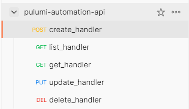

# Pulumi(Python) Over HTTP - Static Websites as a RESTful API
This repo is based on [pulumi example](https://github.com/pulumi/automation-api-examples/tree/main/python/pulumi_over_http)
### **Requirements**
1. Python 3 and pip installed
### **Installation**
> For better isolation, please use virtual environment for python
1. Install dependency
```
pip install -r requirements.txt
```
### **How To**
1. Run app
```
python app.py
```
### **Testing**
1. I already provide postman collection, please import json collection to your postman

